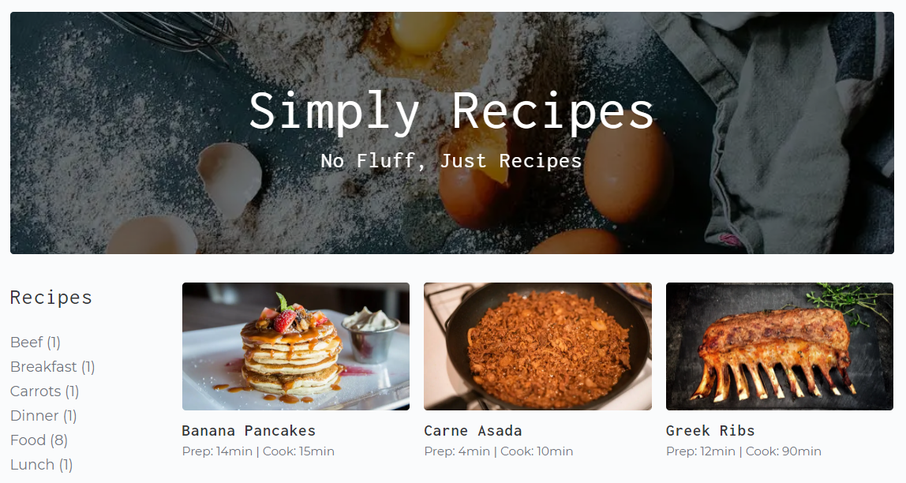

# Simply Recipes Gatsby Blog

> A Gatsby blog to publish food recipes.

<h1 align="center">
  
</h1>


# Built with

<p>
  <a href='https://www.gatsbyjs.com/'>
		
	</a>
  &nbsp;
  <a href='https://www.typescriptlang.org/'>
    
  </a>
</p>


## Status

Currently: _finished_


# Development

## Available Scripts

- Clone the repo

  ```bash
  $ git clone https://github.com/francislagares/recipes-blog.git
  ```

- Install the dependencies by running the following command.

  ```bash
  yarn install
  ```

- Start the development server:

  ```bash
  gatsby develop
  ```

  Open [http://localhost:8000](http://localhost:8000) with your browser to see the
  result.


# Author

Created by [@francislagares](https://www.linkedin.com/in/francislagares/) - feel free to contact me!
* 